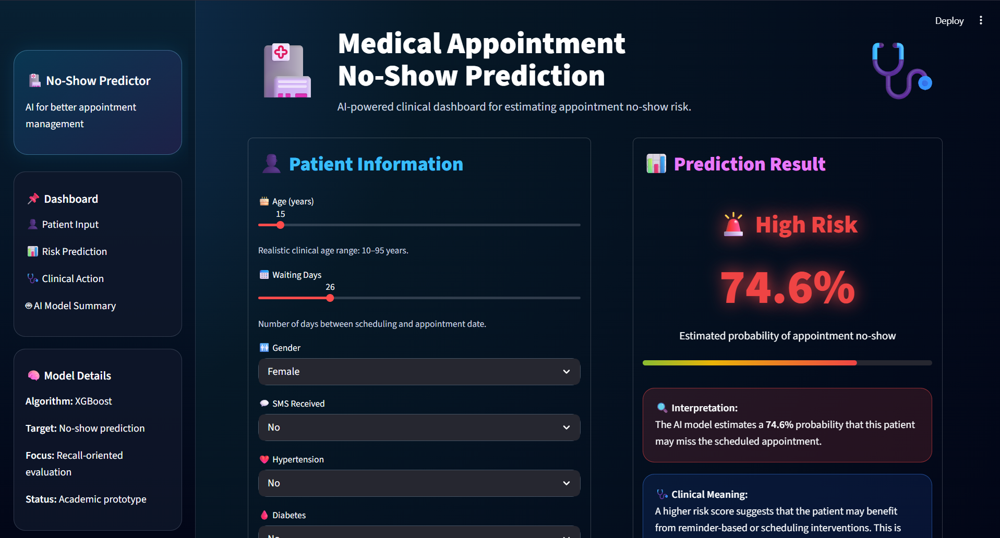

# 🏥 Medical Appointment No-Show Prediction


An AI-powered healthcare project for predicting whether a patient is likely to miss a scheduled medical appointment using machine learning techniques.

---

# 📌 Project Scope

This project aims to predict patient no-shows using healthcare appointment data and machine learning models.  
The goal is to help healthcare providers reduce missed appointments, improve scheduling efficiency, and optimize clinical resource allocation.

The project includes:

- Data preprocessing and cleaning
- Exploratory Data Analysis (EDA)
- Feature engineering
- Machine learning model comparison
- XGBoost optimization for recall
- Interactive AI dashboard using Streamlit

---

# 📊 Dataset Source

The dataset used is the **Medical Appointment No Shows Dataset** from Kaggle.

### Main dataset file:
- `KaggleV2-May-2016.csv`

The dataset contains demographic and appointment-related information such as:

- Age
- Gender
- WaitingDays
- SMS reminders
- Hypertension
- Diabetes
- Scholarship status
- Alcoholism
- Disability
- Appointment attendance outcome

---

# ⚙️ Project Workflow

1. Data loading and inspection
2. Data cleaning and preprocessing
3. Feature engineering
4. Exploratory Data Analysis (EDA)
5. Model training
6. Model evaluation
7. Model comparison
8. Interactive dashboard deployment

---

# 🤖 Models Used

- Logistic Regression
- Balanced Logistic Regression
- Random Forest
- XGBoost

---

# 📈 Final Model Performance

| Model | Recall | Accuracy |
|------|------|------|
| Logistic Regression | 0.58 | 0.79 |
| Random Forest | 0.61 | 0.83 |
| XGBoost | 0.82 | 0.74 |

> XGBoost achieved the best recall for identifying no-show patients, which was the primary objective of this healthcare-focused project.

---

# 📌 Key Findings

- The dataset was imbalanced, requiring class imbalance handling.
- `WaitingDays` was one of the most influential predictive features.
- Longer waiting times were associated with higher no-show probability.
- XGBoost provided stronger recall performance for identifying high-risk patients.
- Operational scheduling factors may contribute to missed appointments in addition to patient behavior.

---

# 🤖 Interactive AI Dashboard

An interactive Streamlit dashboard was developed to demonstrate the trained XGBoost model in a practical clinical setting.

## ✨ Dashboard Features

- Real-time no-show risk prediction
- Interactive patient input controls
- AI-based probability estimation
- Clinical interpretation and suggested actions
- Modern healthcare-inspired interface
- Animated risk indicators
- Medical-themed dashboard design

---

# 🖼 Dashboard Preview



---

# 🧠 Clinical Interpretation

The dashboard estimates the probability that a patient may miss their scheduled appointment based on multiple clinical and operational factors.

Higher predicted risk may indicate the need for:

- Reminder-based interventions
- Scheduling optimization
- Patient follow-up communication
- Appointment confirmation systems

---

# 🚀 Future Improvements

- Deploy the dashboard online using Streamlit Cloud
- Add more clinical variables
- Integrate real hospital appointment systems
- Improve model calibration and explainability
- Add SHAP explainability visualizations
- Add multilingual support for healthcare staff

---

# 💻 How to Run the Project

## 1️⃣ Clone the repository

```bash
git clone https://github.com/zeenah-bio/medical-appointment-no-show-prediction.git
```

---

## 2️⃣ Install required packages

```bash
pip install -r requirements.txt
```

---

## 3️⃣ Run the notebook

Open:

```text
NoShow_Project.ipynb
```

using:

- Google Colab
- Jupyter Notebook

---

## 4️⃣ Run the Streamlit dashboard

```bash
streamlit run app.py
```

---

# 📦 Repository Contents

| File | Description |
|------|-------------|
| `NoShow_Project.ipynb` | Full machine learning pipeline |
| `app.py` | Interactive Streamlit dashboard |
| `requirements.txt` | Required Python packages |
| `model_columns.pkl` | Saved feature columns |
| `no_show_model.pkl` | Trained XGBoost model |
| `data/` | Dataset folder |

---

# 🔬 Technologies Used

- Python
- Pandas
- NumPy
- Matplotlib
- Seaborn
- Scikit-learn
- XGBoost
- Streamlit

---

# 📌 Note

This repository is continuously updated based on feedback and model improvements.

---

# 👩‍💻 Author

**Zeenah Shamil Kamil**  
MSc Student — Artificial Intelligence & Bioinformatics  
University of Baghdad
